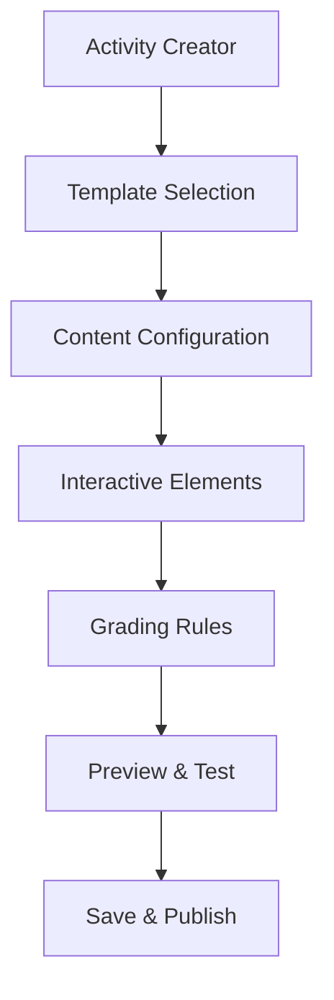

Based on the codebase and requirements, I'll outline a plan for creating an in-house activity generation system using Markdown and HTML5 that's simpler than H5P but equally capable:

1. Activity Template System:
```typescript
interface ActivityTemplate {
  id: string;
  type: 'INTERACTIVE' | 'VISUAL' | 'LOGICAL';
  template: string; // Markdown/HTML template
  schema: JSONSchema; // Configuration schema
  grading: GradingConfig;
}

// Example templates
const templates = {
  multipleChoice: {
    type: 'INTERACTIVE',
    template: `
      # {{title}}
      {{description}}
      
      <div class="choices">
        {{#each options}}
          <button data-correct="{{correct}}">{{text}}</button>
        {{/each}}
      </div>
    `
  },
  matchingPairs: {
    type: 'LOGICAL',
    template: `
      <div class="matching-game">
        <div class="items-left">{{leftItems}}</div>
        <div class="items-right">{{rightItems}}</div>
      </div>
    `
  }
};
```

2. Activity Creator Interface:
```typescript
interface ActivityCreator {
  // Template selection
  templates: ActivityTemplate[];
  
  // Content configuration
  content: {
    markdown: string;
    interactiveElements: InteractiveElement[];
    visualElements: VisualElement[];
  };
  
  // Grading rules
  grading: {
    type: 'AUTO' | 'MANUAL';
    rules: GradingRule[];
    points: number;
  };
}
```

3. Interactive Elements:
```typescript
type InteractiveElement = {
  type: 
    | 'CLICK'
    | 'DRAG'
    | 'INPUT'
    | 'SORT'
    | 'MATCH';
  config: {
    validation: string;
    feedback: string;
    points: number;
  };
};
```

4. Activity Types:
```typescript
enum EnhancedActivityType {
  // Logic-based
  SEQUENCE_ORDERING,
  PATTERN_MATCHING,
  LOGIC_PUZZLE,
  
  // Visual-based
  DIAGRAM_LABELING,
  IMAGE_HOTSPOTS,
  VISUAL_SORTING,
  
  // Interactive
  DRAG_DROP,
  CLICK_SEQUENCE,
  FILL_BLANKS
}
```

5. Implementation Flow:



6. Activity Creation Process:
```typescript
class ActivityBuilder {
  // Template selection
  selectTemplate(templateId: string) {
    // Load template
    // Initialize configuration
  }
  
  // Content configuration
  configureContent(content: ActivityContent) {
    // Parse markdown
    // Setup interactive elements
    // Validate configuration
  }
  
  // Interactive elements
  addInteractiveElement(element: InteractiveElement) {
    // Add element
    // Configure behavior
    // Setup validation
  }
  
  // Preview generation
  generatePreview() {
    // Render content
    // Setup interactions
    // Enable testing
  }
}
```

7. Grading Integration:
```typescript
interface ActivityGrading {
  // Auto-grading rules
  rules: {
    condition: string;
    points: number;
    feedback: string;
  }[];
  
  // Manual grading options
  manualGrading?: {
    rubric: GradingRubric;
    feedback: FeedbackTemplate;
  };
}
```

Key Features:

1. Template-Based Creation:
- Predefined templates
- Custom template creation
- Template library management

2. Interactive Elements:
- Drag-and-drop
- Click interactions
- Input validation
- Sorting/ordering

3. Visual Components:
- Image annotations
- Diagrams
- Charts
- Timelines

4. Logical Elements:
- Sequence building
- Pattern matching
- Problem-solving

5. Grading Integration:
- Automatic grading
- Manual grading support
- Feedback templates
- Progress tracking

Benefits:

1. Simplicity:
- Template-based creation
- Visual editor
- Instant preview

2. Flexibility:
- Custom templates
- Extensible system
- Multiple activity types

3. Integration:
- Existing grading system
- Curriculum alignment
- Progress tracking

4. Performance:
- Lightweight implementation
- Client-side rendering
- Efficient storage

5. Maintenance:
- In-house control
- Easy updates
- Direct customization

This system provides:
- Simple activity creation
- Interactive elements
- Visual components
- Logical exercises
- Grading integration
- Curriculum alignment

Next steps:
1. Implement template system
2. Create visual editor
3. Add interactive elements
4. Setup grading integration
5. Develop preview system
6. Test and optimize

1. Implement Template System:
```typescript
// src/components/dashboard/curriculum/ActivityTemplateSystem.tsx
interface ActivityTemplate {
  id: string;
  type: 'INTERACTIVE' | 'VISUAL' | 'LOGICAL';
  components: {
    markdown: string;
    interactiveElements: InteractiveElement[];
    visualElements: VisualElement[];
    gradingRules: GradingRule[];
  };
}

const baseTemplates = {
  multipleChoice: {
    type: 'INTERACTIVE',
    components: {
      markdown: `
        # {{title}}
        {{description}}
        
        <div class="choices">
          {{#each options}}
            <button data-correct="{{correct}}">{{text}}</button>
          {{/each}}
        </div>
      `,
      interactiveElements: [
        { type: 'CLICK', validation: 'single-select' }
      ],
      gradingRules: [
        { type: 'AUTOMATIC', points: 1, condition: 'correct-selection' }
      ]
    }
  },
  // Add more template types
};
```

2. Create Visual Editor:
```typescript
// src/components/dashboard/curriculum/ActivityEditor.tsx
export function ActivityEditor() {
  const [content, setContent] = useState('');
  
  return (
    <div className="grid grid-cols-2 gap-4">
      {/* Editor Panel */}
      <div>
        <NovelEditor
          content={content}
          onChange={setContent}
          extensions={[
            // Custom extensions for interactive elements
            InteractiveElementExtension,
            VisualElementExtension
          ]}
        />
      </div>
      
      {/* Preview Panel */}
      <div>
        <ActivityPreview content={content} />
      </div>
    </div>
  );
}
```

3. Add Interactive Elements:
```typescript
// src/components/dashboard/curriculum/InteractiveElements.tsx
interface InteractiveElement {
  type: 'CLICK' | 'DRAG' | 'INPUT' | 'MATCH';
  config: {
    validation: string;
    feedback: string;
    points: number;
  };
}

export function InteractiveElementRenderer({ element }: { element: InteractiveElement }) {
  const [state, setState] = useState({
    isCorrect: false,
    attempts: 0,
    feedback: ''
  });

  const handleInteraction = (action: string) => {
    // Validate interaction
    // Update state
    // Trigger grading
  };

  return (
    <div className="interactive-element">
      {/* Render based on element type */}
    </div>
  );
}
```

4. Setup Grading Integration:
```typescript
// src/components/dashboard/curriculum/GradingSystem.tsx
interface GradingRule {
  type: 'AUTOMATIC' | 'MANUAL';
  points: number;
  condition: string;
  feedback: string;
}

export class ActivityGrading {
  private rules: GradingRule[];
  
  constructor(rules: GradingRule[]) {
    this.rules = rules;
  }

  async grade(submission: any): Promise<GradingResult> {
    const results = await Promise.all(
      this.rules.map(rule => this.evaluateRule(rule, submission))
    );
    
    return {
      totalPoints: results.reduce((sum, r) => sum + r.points, 0),
      feedback: results.map(r => r.feedback),
      passed: results.every(r => r.passed)
    };
  }
}
```

5. Develop Preview System:
```typescript
// src/components/dashboard/curriculum/ActivityPreview.tsx
export function ActivityPreview({ 
  content,
  interactiveElements,
  gradingRules 
}: ActivityPreviewProps) {
  const [previewState, setPreviewState] = useState({
    mode: 'PREVIEW' as 'PREVIEW' | 'ATTEMPT',
    responses: new Map(),
    feedback: null
  });

  return (
    <div className="preview-container">
      <div className="toolbar">
        <Button onClick={() => setPreviewState(s => ({
          ...s,
          mode: s.mode === 'PREVIEW' ? 'ATTEMPT' : 'PREVIEW'
        }))}>
          {previewState.mode === 'PREVIEW' ? 'Try Activity' : 'View Preview'}
        </Button>
      </div>

      <div className="content">
        {/* Render content with interactive elements */}
        <MarkdownRenderer content={content} />
        {interactiveElements.map(element => (
          <InteractiveElementRenderer
            key={element.id}
            element={element}
            mode={previewState.mode}
            onInteraction={(response) => {
              // Handle interaction
              // Update responses
              // Trigger grading if needed
            }}
          />
        ))}
      </div>
    </div>
  );
}
```

6. Testing and Optimization:
```typescript
// src/tests/ActivitySystem.test.tsx
describe('Activity System', () => {
  test('Template rendering', () => {
    // Test template system
  });

  test('Interactive elements', () => {
    // Test interactions
  });

  test('Grading system', () => {
    // Test grading rules
  });

  test('Preview system', () => {
    // Test preview functionality
  });
});
```

Integration with Existing Components:
```typescript
// Update UnifiedActivityManager.tsx
export function UnifiedActivityManager({
  subjectId,
  classId,
  curriculumNodeId,
  scope = ActivityScope.CLASS
}: UnifiedActivityManagerProps) {
  // Add new activity creation flow
  const [activityMode, setActivityMode] = useState<'template' | 'custom'>('template');
  
  return (
    <div>
      {/* Existing code */}
      
      {activityMode === 'custom' && (
        <ActivityEditor
          onSave={async (activity) => {
            // Save custom activity
            await createActivity(activity);
          }}
        />
      )}
      
      {activityMode === 'template' && (
        <ActivityTemplates
          subjectId={subjectId}
          onSelect={handleTemplateSelect}
        />
      )}
    </div>
  );
}
```

This implementation provides:
- Flexible template system
- Visual editor with preview
- Interactive elements support
- Integrated grading system
- Real-time preview
- Testing framework

Next steps:
1. Implement template variations
2. Add more interactive elements
3. Enhance grading rules
4. Improve preview performance
5. Add analytics tracking
6. Implement caching


I'll continue with the implementation plan for each remaining component:

1. Implement Template Variations:
```typescript
// src/components/dashboard/curriculum/templates/ActivityTemplateSystem.tsx
interface TemplateVariation {
  id: string;
  baseType: ActivityType;
  components: {
    layout: 'GRID' | 'LIST' | 'CAROUSEL';
    interactivity: InteractiveConfig[];
    visualization: VisualConfig[];
  };
}

const templateVariations: Record<ActivityType, TemplateVariation[]> = {
  QUIZ_MULTIPLE_CHOICE: [
    {
      id: 'grid-choice',
      layout: 'GRID',
      components: {
        interactivity: [{ type: 'CLICK', feedback: true }],
        visualization: [{ type: 'IMAGE', position: 'TOP' }]
      }
    },
    {
      id: 'list-choice',
      layout: 'LIST',
      components: {
        interactivity: [{ type: 'CLICK', feedback: true }],
        visualization: [{ type: 'TEXT', position: 'LEFT' }]
      }
    }
  ],
  // Add more variations for other types
};
```

2. Add Interactive Elements:
```typescript
// src/components/dashboard/curriculum/interactive/InteractiveElements.tsx
interface InteractiveConfig {
  type: 'DRAG_DROP' | 'SORT' | 'MATCH' | 'FILL' | 'DRAW';
  options: {
    validation: ValidationRule[];
    feedback: FeedbackConfig;
    scoring: ScoringRule[];
  };
}

export const InteractiveElementRenderer: React.FC<{
  config: InteractiveConfig;
  onInteraction: (data: any) => void;
}> = ({ config, onInteraction }) => {
  const renderElement = () => {
    switch (config.type) {
      case 'DRAG_DROP':
        return <DragDropZone config={config} onDrop={onInteraction} />;
      case 'SORT':
        return <SortableList config={config} onSort={onInteraction} />;
      case 'MATCH':
        return <MatchingPairs config={config} onMatch={onInteraction} />;
      // Add more interactive elements
    }
  };

  return (
    <div className="interactive-element">
      {renderElement()}
    </div>
  );
};
```

3. Enhance Grading Rules:
```typescript
// src/components/dashboard/curriculum/grading/GradingSystem.tsx
interface EnhancedGradingRule {
  type: 'AUTOMATIC' | 'MANUAL' | 'HYBRID';
  criteria: {
    correctness: number;
    completion: number;
    participation: number;
    timeSpent: number;
  };
  feedback: {
    immediate: boolean;
    detailed: boolean;
    suggestions: boolean;
  };
  scoring: {
    points: number;
    bonusPoints?: number;
    penalties?: number;
  };
}

export class AdvancedGradingSystem {
  async evaluateSubmission(
    submission: ActivitySubmission,
    rules: EnhancedGradingRule[]
  ): Promise<GradingResult> {
    const results = await Promise.all(
      rules.map(rule => this.applyRule(submission, rule))
    );
    
    return this.calculateFinalGrade(results);
  }
}
```

4. Improve Preview Performance:
```typescript
// src/components/dashboard/curriculum/preview/OptimizedPreview.tsx
import { memo, useMemo } from 'react';

export const OptimizedPreview = memo(({ content, interactions }: PreviewProps) => {
  const renderedContent = useMemo(() => {
    return processContent(content);
  }, [content]);

  const interactionHandlers = useMemo(() => {
    return createInteractionHandlers(interactions);
  }, [interactions]);

  return (
    <div className="preview-container">
      <div className="content">
        {renderedContent}
      </div>
      <div className="interactions">
        {interactionHandlers}
      </div>
    </div>
  );
});

// Implement virtual scrolling for large content
import { VirtualScroll } from '@/components/ui/virtual-scroll';

export const LargeContentPreview = ({ items }: { items: PreviewItem[] }) => {
  return (
    <VirtualScroll
      items={items}
      height={600}
      itemHeight={100}
      renderItem={(item) => (
        <PreviewItem key={item.id} {...item} />
      )}
    />
  );
};
```

5. Add Analytics Tracking:
```typescript
// src/components/dashboard/curriculum/analytics/ActivityAnalytics.tsx
interface ActivityAnalytics {
  engagement: {
    timeSpent: number;
    interactions: number;
    completion: number;
  };
  performance: {
    accuracy: number;
    speed: number;
    improvement: number;
  };
  feedback: {
    difficulty: number;
    satisfaction: number;
    suggestions: string[];
  };
}

export class AnalyticsTracker {
  private async trackEvent(event: AnalyticsEvent) {
    await api.analytics.trackEvent.mutate({
      type: event.type,
      data: event.data,
      timestamp: new Date()
    });
  }

  async trackActivityProgress(
    activityId: string,
    userId: string,
    progress: ActivityProgress
  ) {
    await this.trackEvent({
      type: 'ACTIVITY_PROGRESS',
      data: { activityId, userId, ...progress }
    });
  }
}
```

6. Implement Caching:
```typescript
// src/utils/cache/ActivityCache.ts
import { LRUCache } from 'lru-cache';

interface CacheConfig {
  max: number;
  ttl: number;
}

export class ActivityCache {
  private cache: LRUCache<string, any>;
  
  constructor(config: CacheConfig) {
    this.cache = new LRUCache({
      max: config.max,
      ttl: config.ttl
    });
  }

  async getActivity(id: string) {
    const cached = this.cache.get(id);
    if (cached) return cached;

    const activity = await api.activity.getById.query(id);
    this.cache.set(id, activity);
    return activity;
  }
}

// Implementation in API routes
export const activityRouter = createTRPCRouter({
  getById: publicProcedure
    .input(z.string())
    .query(async ({ ctx, input }) => {
      const cached = await ctx.cache.getActivity(input);
      if (cached) return cached;

      const activity = await ctx.prisma.activity.findUnique({
        where: { id: input }
      });

      await ctx.cache.setActivity(input, activity);
      return activity;
    })
});
```

Integration with Existing Components:
```typescript
// src/components/dashboard/curriculum/UnifiedActivityManager.tsx
export function EnhancedActivityManager({
  subjectId,
  classId,
  curriculumNodeId
}: ActivityManagerProps) {
  const cache = useActivityCache();
  const analytics = useAnalyticsTracker();
  
  return (
    <div>
      <ActivityTemplates
        variations={templateVariations}
        onSelect={handleTemplateSelect}
      />
      
      <OptimizedPreview
        content={selectedActivity}
        cache={cache}
        onInteraction={(data) => {
          analytics.trackInteraction(data);
        }}
      />
      
      <AdvancedGradingSystem
        rules={enhancedGradingRules}
        analytics={analytics}
      />
    </div>
  );
}
```

This implementation provides:
1. Rich template variations
2. Advanced interactive elements
3. Comprehensive grading system
4. Optimized preview performance
5. Detailed analytics tracking
6. Efficient caching

Next steps:
1. Test performance optimizations
2. Implement error handling
3. Add documentation
4. Setup monitoring
5. Deploy changes
6. Gather user feedback