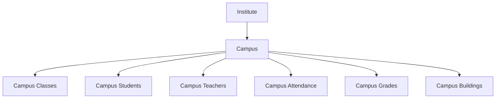
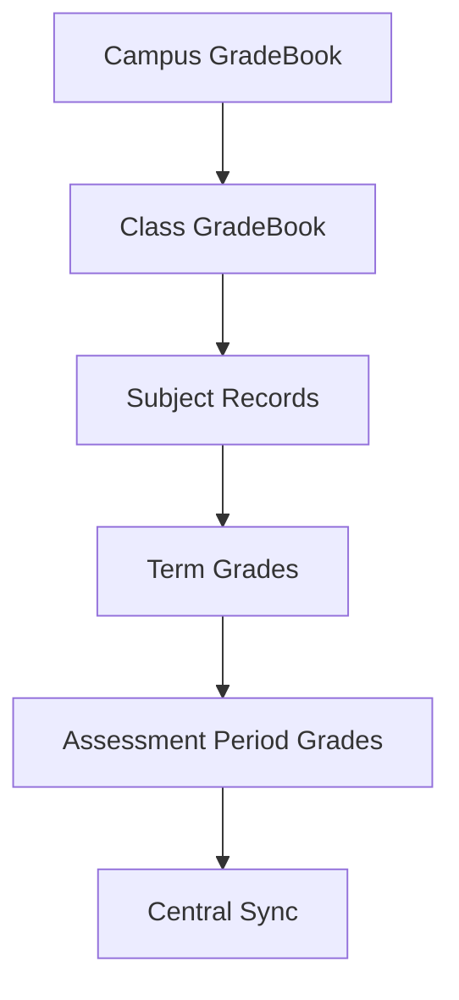
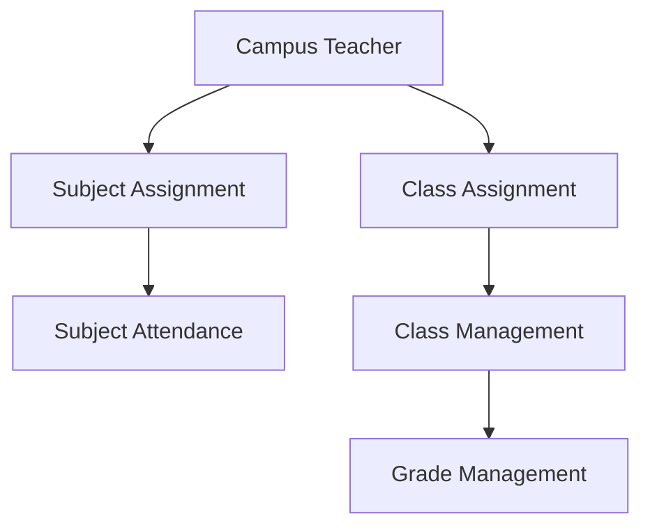
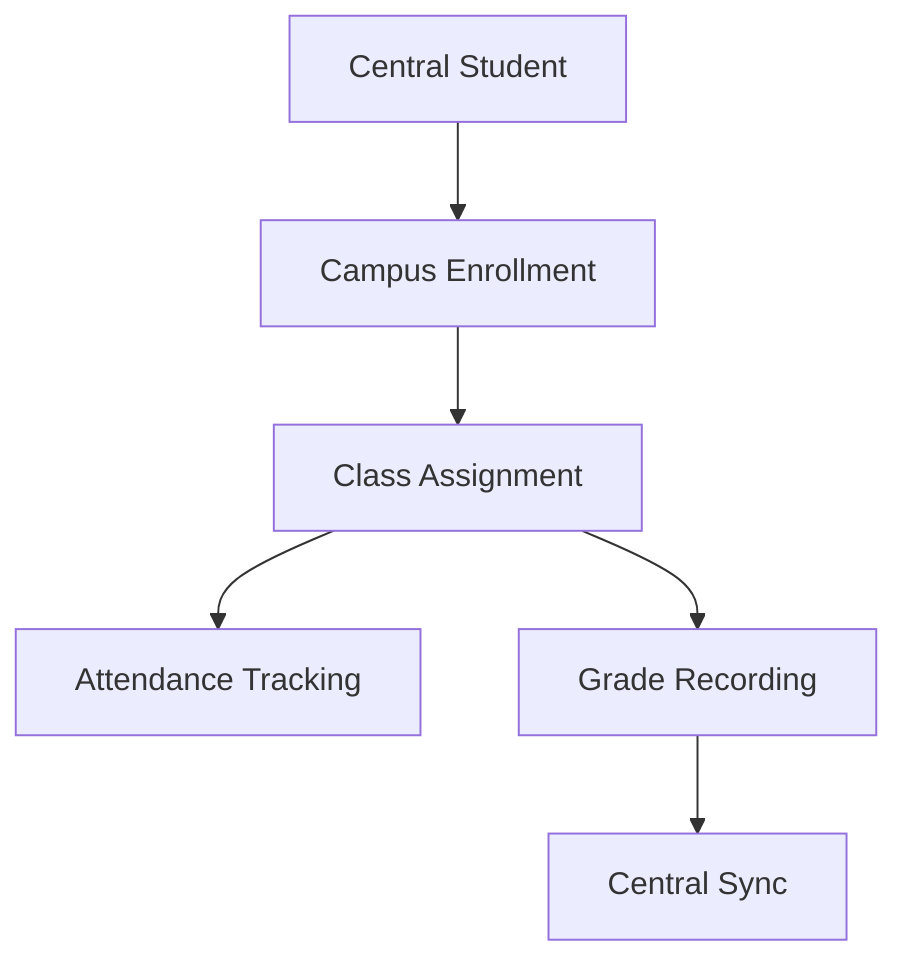
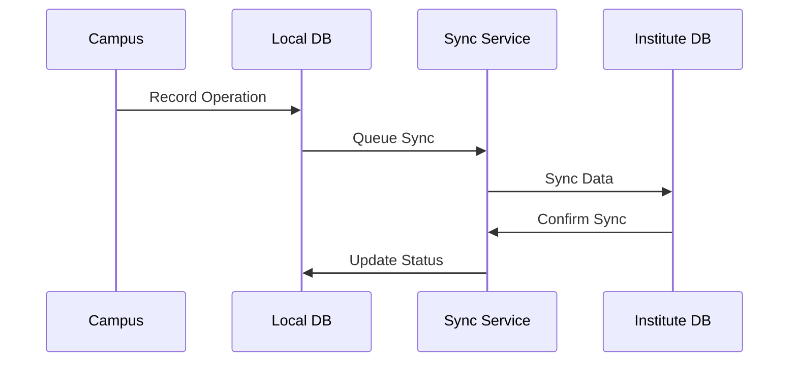

Based on the provided codebase and the existing implementation, I'll outline a comprehensive flow for the campus entity integration:

1. Core Entity Structure


2. Data Flow Integration with Existing Types
```typescript
// Extending existing types
interface Campus {
  id: string;
  name: string;
  code: string;
  status: Status;
  // Location and contact details
  buildings: CampusBuilding[];
  classes: CampusClass[];
  teachers: CampusTeacher[];
  students: CampusStudent[];
}

interface CampusClass extends Class {
  campusId: string;
  campus: Campus;
  // Inherits existing Class properties
  gradeBook: GradeBookRecord;
  students: Student[];
  teachers: Teacher[];
}
```

3. Gradebook Integration


4. Attendance System Integration
```typescript
interface CampusAttendance {
  campusId: string;
  classId: string;
  date: Date;
  records: {
    studentId: string;
    status: AttendanceStatus;
    subjectId?: string;
  }[];
}
```

5. Teacher Assignment Flow


6. Student Management Flow


7. Campus Operations Integration
```typescript
class CampusOperationsService {
  // Attendance Management
  async recordAttendance(data: CampusAttendance) {
    // Record attendance locally
    // Sync with central database
  }

  // Grade Management
  async updateGrades(classId: string, gradeData: GradeBookRecord) {
    // Update local grades
    // Sync with central gradebook
  }

  // Class Management
  async createCampusClass(data: CreateCampusClassInput) {
    // Create class with campus association
    // Initialize gradebook
    // Setup attendance tracking
  }
}
```

8. Access Control Implementation
```typescript
enum CampusPermissions {
  CAMPUS_ADMIN = 'CAMPUS_ADMIN',
  CAMPUS_TEACHER = 'CAMPUS_TEACHER',
  CAMPUS_COORDINATOR = 'CAMPUS_COORDINATOR'
}

interface CampusRole {
  campusId: string;
  userId: string;
  permissions: CampusPermissions[];
}
```

9. Data Synchronization Flow


10. API Integration
```typescript
// Campus Router Extension
export const campusRouter = createTRPCRouter({
  // Existing campus management endpoints
  createClass: protectedProcedure
    .input(createCampusClassSchema)
    .mutation(async ({ ctx, input }) => {
      // Create class with campus association
    }),

  recordAttendance: protectedProcedure
    .input(campusAttendanceSchema)
    .mutation(async ({ ctx, input }) => {
      // Record and sync attendance
    }),

  updateGrades: protectedProcedure
    .input(campusGradeSchema)
    .mutation(async ({ ctx, input }) => {
      // Update and sync grades
    })
});
```

This implementation:
1. Maintains consistency with existing types (Class, Student, Teacher)
2. Integrates with the gradebook system
3. Supports attendance tracking
4. Enables local operations with central sync
5. Provides clear access control
6. Ensures data consistency
7. Supports scalability
8. Facilitates reporting at both levels

The system follows the bank branch analogy where:
- Campus = Branch
- Central Database = Head Office
- Local Operations = Branch Operations
- Sync Service = Banking Network
- Access Control = Branch Authority Levels

This structure ensures efficient local operations while maintaining central oversight and standardization.