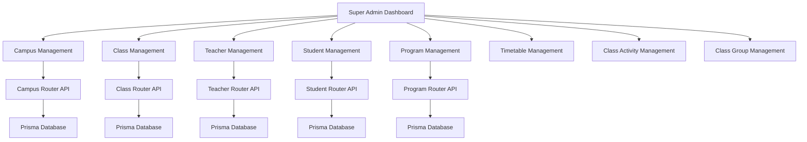
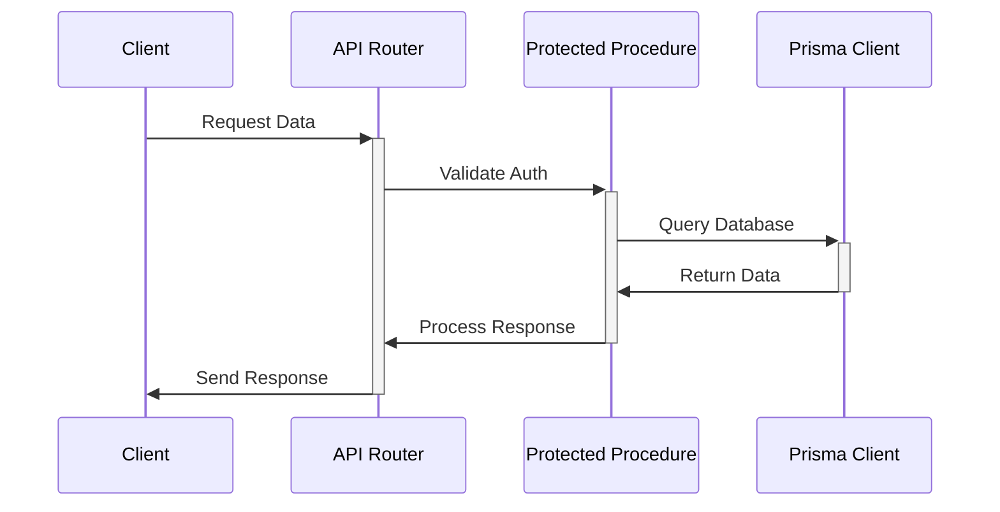

Based on the provided codebase, I'll create a comprehensive review of the centralized institution and campus implementation, including system architecture flow and schema analysis.

## System Architecture Flow Diagram



## Core Components Structure

1. **Campus Management**
   - CRUD operations for campuses
   - Building/Floor/Wing/Room hierarchy
   - Status tracking (ACTIVE/INACTIVE)
   - Bulk operations support

2. **Class Management**
   - Class creation and assignment
   - Teacher-class associations
   - Student enrollment
   - Capacity management
   - Class group associations

3. **Teacher Management**
   - Teacher profiles
   - Subject assignments
   - Class assignments
   - Bulk upload capability
   - Status management

4. **Student Management**
   - Student enrollment
   - Program assignments
   - Class assignments
   - Search and filter functionality
   - Bulk operations

## Data Flow Architecture



## Schema Infrastructure Analysis

1. **Campus Schema**
```typescript
Campus {
    id: string
    name: string
    code: string
    status: Status
    buildings: Building[]
    classes: Class[]
    teachers: Teacher[]
    students: Student[]
}
```

2. **Class Schema**
```typescript
Class {
    id: string
    name: string
    capacity: number
    status: Status
    campusId: string
    classGroupId: string
    teachers: Teacher[]
    students: Student[]
    activities: ClassActivity[]
}
```

3. **Program Schema**
```typescript
Program {
    id: string
    name: string
    description: string
    status: Status
    calendar: Calendar
    coordinator: User
    classGroups: ClassGroup[]
    assessmentSystem: AssessmentSystem
}
```

## Scalability Features

1. **Database Layer**
- Prisma ORM for type-safe database operations
- Efficient relationship handling
- Transaction support for complex operations
- Indexing for optimized queries

2. **API Layer**
- TRPC for type-safe API routes
- Protected procedures for security
- Modular router structure
- Efficient data fetching with query optimization

3. **Frontend Layer**
- Component-based architecture
- State management for complex data
- Lazy loading for better performance
- Reusable UI components

4. **Security Features**
- Protected routes
- Role-based access control
- Input validation
- Data sanitization

## Infrastructure Completeness Assessment

✅ **Complete Features**:
- Basic CRUD operations for all entities
- User role management
- Data relationship handling
- Bulk operations support
- Search and filter functionality

🔄 **Scalability Features**:
- Modular component structure
- Type-safe database operations
- Protected API routes
- Efficient data fetching

⚠️ **Potential Improvements**:
- Caching implementation
- Real-time updates
- Advanced analytics
- Performance optimization for large datasets
- API rate limiting
- Backup and recovery systems

I'll analyze the database structure, entities, and relationships from the provided schema.prisma file to evaluate their optimization and logical campus relationships.

## Database Structure Analysis

### Core Entities and Their Relationships

1. **Campus (Root Entity)**
```prisma
model Campus {
  id                String     @id @default(cuid())
  name              String
  code              String     @unique
  establishmentDate DateTime
  type              CampusType
  status            Status     @default(ACTIVE)
  buildings         Building[]
  roles             CampusRole[]
  features          CampusFeature[]
  sync             CampusSync?
  classes          Class[]
}
```
✅ Optimal: 
- Unique code enforcement
- Clear type definition
- Status tracking
- One-to-many relationships with buildings
- Feature management system
- Sync tracking capability

2. **Building-Floor-Wing-Room Hierarchy**
```prisma
model Building {
  id        String   @id @default(cuid())
  campusId  String
  campus    Campus   @relation(fields: [campusId], references: [id])
  floors    Floor[]
  classes   Class[]
}

model Floor {
  id         String   @id @default(cuid())
  buildingId String
  building   Building @relation(fields: [buildingId], references: [id])
  wings      Wing[]
}

model Wing {
  id        String   @id @default(cuid())
  floorId   String
  floor     Floor    @relation(fields: [floorId], references: [id])
  rooms     Room[]
}

model Room {
  id        String     @id @default(cuid())
  wingId    String
  wing      Wing       @relation(fields: [wingId], references: [id])
  type      RoomType
  capacity  Int
  status    RoomStatus
  classes   Class[]
}
```
✅ Well-structured:
- Clear hierarchical relationships
- Proper foreign key constraints
- Cascading relationships
- Room type and status tracking

3. **User and Role Management**
```prisma
model User {
  userType         UserType?
  userRoles        UserRole[]
  CampusRole       CampusRole[]
  studentProfile   StudentProfile?
  teacherProfile   TeacherProfile?
  coordinatorProfile CoordinatorProfile?
}

model CampusRole {
  id          String   @id @default(cuid())
  userId      String
  campusId    String
  role        String
  permissions String[]
  user        User     @relation(fields: [userId], references: [id])
  campus      Campus   @relation(fields: [campusId], references: [id])
}
```
✅ Optimal:
- Role-based access control
- Campus-specific permissions
- Multiple role support
- Profile type segregation

### Academic Structure

```prisma
model Program {
  id               String   @id @default(cuid())
  calendar         Calendar @relation(fields: [calendarId], references: [id])
  classGroups      ClassGroup[]
  assessmentSystem AssessmentSystem?
}

model ClassGroup {
  id          String    @id @default(cuid())
  program     Program   @relation(fields: [programId], references: [id])
  classes     Class[]
  subjects    Subject[]
}

model Class {
  id           String     @id @default(cuid())
  campusId     String
  campus       Campus     @relation(fields: [campusId], references: [id])
  buildingId   String?
  building     Building?  @relation(fields: [buildingId], references: [id])
  roomId       String?
  room         Room?      @relation(fields: [roomId], references: [id])
}
```
✅ Well-structured:
- Clear program hierarchy
- Flexible class grouping
- Campus-building-room associations

### Areas for Improvement

1. **Data Integrity**
```suggestion
model Campus {
  // Add cascade delete behavior
  buildings Building[] @relation("CampusBuildings", onDelete: Cascade)
  // Add data validation constraints
  code String @unique @regex("^[A-Z]{2,4}-\d{3}$")
}
```

2. **Performance Optimization**
```suggestion
model Room {
  // Add indexes for frequent queries
  @@index([type, status])
  // Add composite indexes
  @@index([wingId, type])
}
```

3. **Relationship Enhancement**
```suggestion
model Class {
  // Add mandatory relationships
  campusId String @map("campus_id")
  // Add better constraints
  capacity Int @default(30) @min(1) @max(100)
}
```

### Recommendations for Optimization

1. **Index Optimization**
- Add indexes for frequently queried fields
- Create composite indexes for related queries
- Optimize search patterns

2. **Relationship Constraints**
- Implement stricter foreign key constraints
- Add cascade delete where appropriate
- Define clear relationship rules

3. **Data Validation**
- Add field validation rules
- Implement check constraints
- Define clear data formats

4. **Performance Enhancements**
- Add caching strategies
- Implement connection pooling
- Optimize query patterns

5. **Scalability Improvements**
- Add sharding capabilities
- Implement partitioning strategies
- Plan for horizontal scaling

The overall database structure is well-designed with clear entity relationships and proper campus integration. The hierarchical structure from Campus down to Room is logical and well-maintained. The role-based access control system is robust and flexible. However, implementing the suggested optimizations would further enhance performance, scalability, and data integrity.