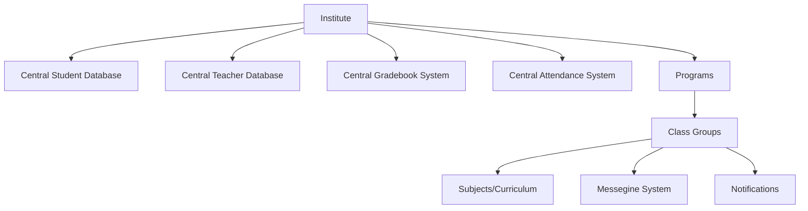
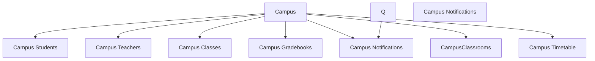
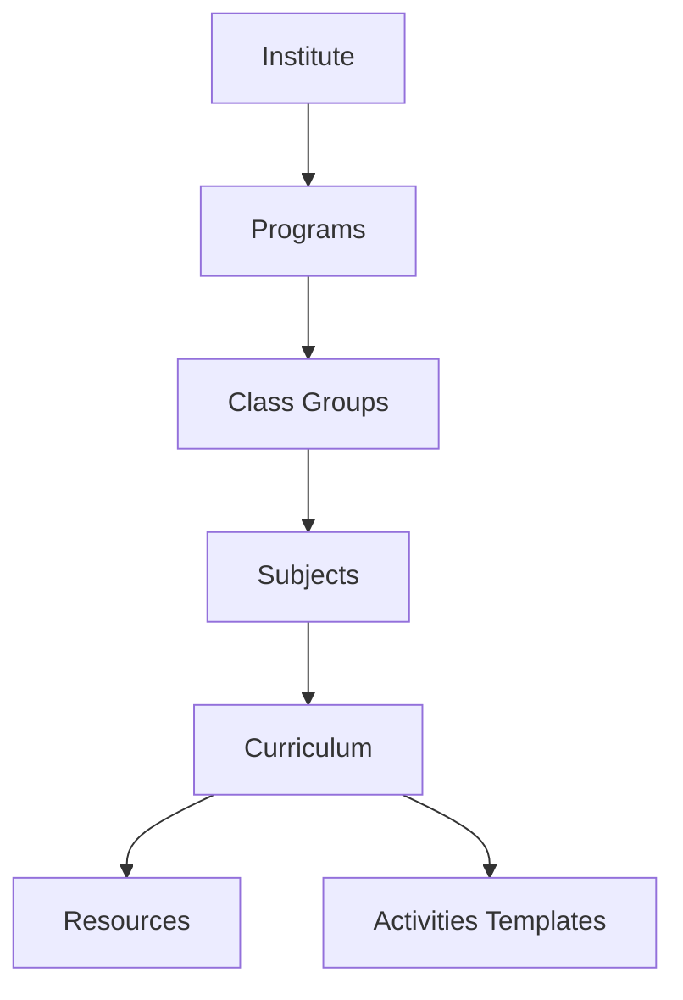
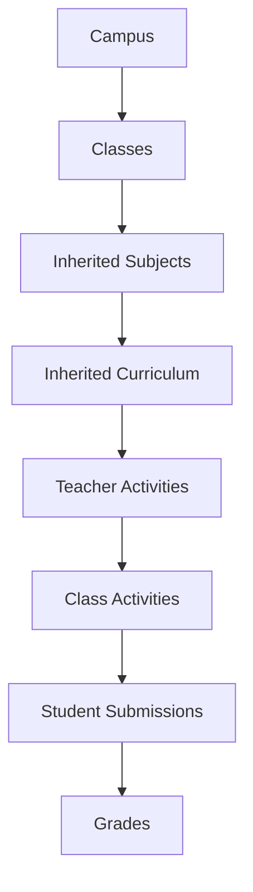
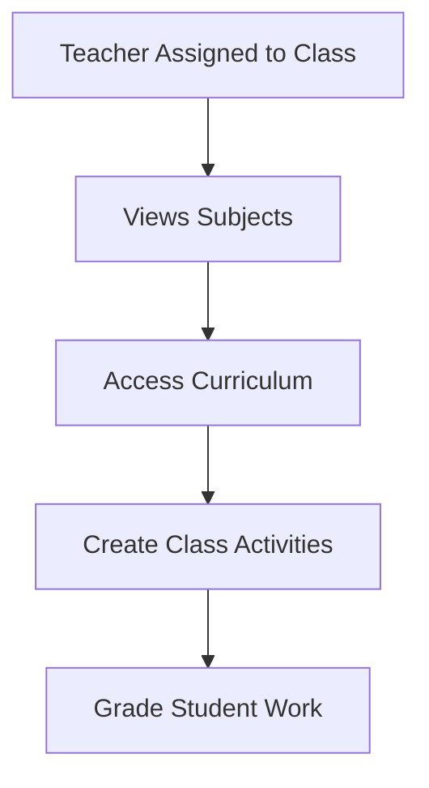
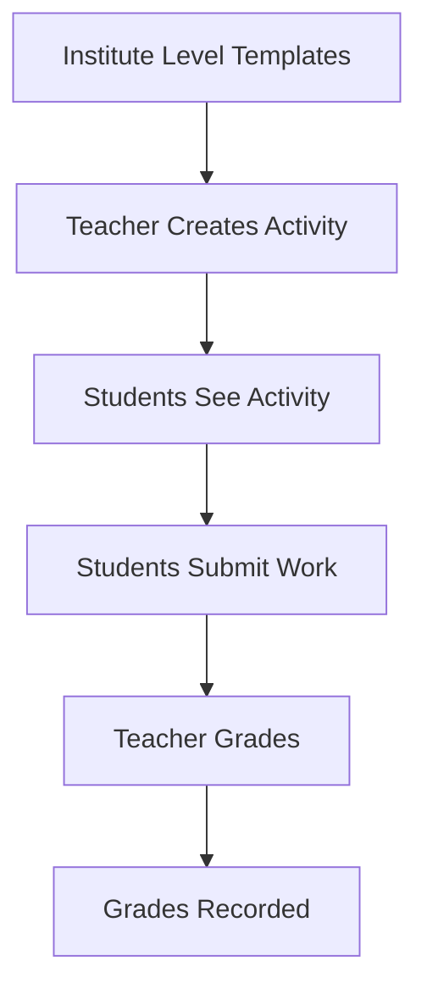
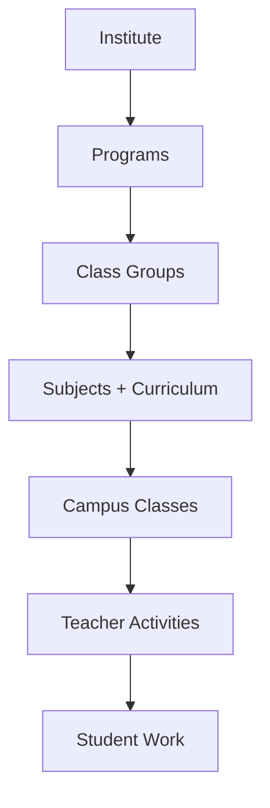

Let me explain the system architecture in simple terms, like explaining how a school system would work:

Think of it like a big school organization (Institute) that has multiple school buildings (Campuses) in different locations.

Here's how the new system would work:

1. At the TOP LEVEL (Institute):

2. Then at each SCHOOL BUILDING (Campus):

    User Experience Portals:

mermaid

graph TD

    A[Personalized Portals] --> B[Teacher Portal]

    A --> C[Student Portal]

    A --> D[Parent Portal]

    A --> E[Admin Portal]

    A --> F[Program Coordinator Portal]

3. How they CONNECT:

Communication System

    Internal messaging
    Parent-teacher communication
    Announcement broadcasts

Notifications System

Real-world example:
1. When a new student joins:
- They're first added to the Institute's central database
- Then they're linked to their specific campus
- Any updates (like grades or attendance) sync between campus and institute levels

Think of it like a bank with multiple branches:
- Your account exists at the main bank (Institute level)
- You can access it from any branch (Campus level)
- All transactions are recorded centrally but can be viewed at branch level

Benefits:
1. One source of truth (central database)
2. Easy to transfer students between campuses
3. Unified reporting at institute level
4. Campus-specific management still possible
5. Real-time data sync between levels

This way:
- The institute has a complete view of all students, teachers, grades, and attendance
- Each campus can manage their day-to-day operations
- Data flows smoothly between both levels
- Reports can be generated for either the whole institute or specific campuses

Let me explain the complete system architecture in a simple way, including how subjects, curriculum, and activities flow from top to bottom:

1. INSTITUTE LEVEL (The Main Office)

Think of this like a school's head office that:
- Creates programs (like Primary, Secondary)
- Defines class groups (like Grade 1, Grade 2)
- Sets up subjects (Math, Science)
- Creates curriculum (chapters, topics)
- Provides learning resources (books, videos)
- Creates activity templates (quiz types, assignment formats)

2. CAMPUS LEVEL (Individual School Buildings)

Each campus:
- Creates actual classes (like Grade 1-A, Grade 1-B)
- Gets subjects from institute level
- Gets curriculum from institute level
- Lets teachers create activities
- Manages student work and grades

3. TEACHER'S WORKFLOW

For example:
1. Math teacher of Grade 1-A:
   - Sees Math curriculum from institute
   - Creates a quiz for Chapter 1
   - Assigns it to students
   - Grades submissions
   - Records scores

4. ACTIVITY FLOW

Real-world example:
1. Institute provides quiz template
2. Grade 1 Math teacher:
   - Creates "Addition Quiz"
   - Uses institute template
   - Sets deadline
   - Assigns to class
3. Students:
   - See quiz in their portal
   - Complete and submit
4. Teacher:
   - Grades submissions
   - Provides feedback

5. DATA STRUCTURE

Like a filing system:
- Institute keeps master copies
- Campus has working copies
- Teachers add their materials
- Students submit their work
- Everything stays organized and connected

Benefits:
1. Standardization:
   - All campuses follow same curriculum
   - Activities maintain quality standards
   - Grading is consistent

2. Flexibility:
   - Teachers can customize activities
   - Each campus manages its classes
   - Students get personalized attention

3. Organization:
   - Clear flow of information
   - Easy to track progress
   - Everything properly connected

This structure ensures:
- Quality control from institute level
- Freedom for teachers to teach their way
- Easy management of student work
- Clear tracking of grades and progress

Does this help explain how everything flows from top to bottom? Let me know if you need any part explained in more detail!